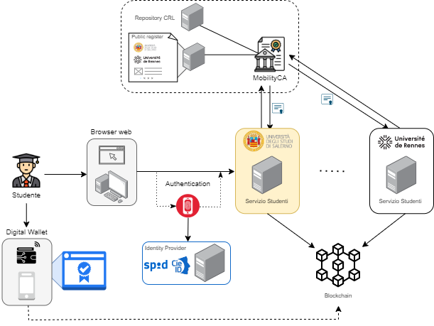

# UniChain

> **Sistema distribuito per la gestione sicura e verificabile delle credenziali accademiche digitali**

---

## 📖 Descrizione

UniChain è un prototipo di infrastruttura **blockchain permissioned** per la gestione di **Certificati Accademici Digitali (CAD)** e dell'accreditamento delle università. È stato sviluppato come progetto del corso *Algoritmi e Protocolli per la Sicurezza* presso l'Università di Salerno.

Il sistema consente:

* Emissione di credenziali accademiche digitali firmate crittograficamente da università accreditate.
* Archiviazione sicura delle credenziali nel **wallet digitale dello studente**.
* Presentazione selettiva di attributi specifici delle credenziali per garantire la privacy dello studente.
* Ancoraggio delle credenziali su blockchain per integrità e non ripudio.
* Revoca di credenziali errate o compromesse.
* Revoca dell’accreditamento universitario da parte dell’autorità centrale (*MobilityCA*).
* Verifica decentralizzata della validità delle credenziali e dello stato di accreditamento delle università.
* Consenso PBFT per l'aggiunta dei blocchi: le università accreditate partecipano al processo di validazione distribuita per garantire affidabilità e tolleranza ai guasti.

Sono stati condotti test di performance per valutare la latenza delle operazioni crittografiche principali (hash, firma, verifica, Merkle Proof) e la dimensione serializzata delle credenziali e delle presentazioni selettive.  
Le misurazioni sono state effettuate tramite script Python integrati (`performance_test.py`) su ambiente locale.

---

## 🛠️ Funzionalità principali

✅ **Accreditamento università**

* Le università richiedono un certificato digitale all'ente centrale (*MobilityCA*) per essere abilitate all'emissione di credenziali.

✅ **Emissione credenziali accademiche (CAD)**

* Le università accreditate emettono CAD per attestare esami e titoli accademici.

✅ **Ancoraggio su blockchain permissioned**

* Ogni CAD viene registrato come transazione con `TransactionType=EMISSION`.

✅ **Consenso PBFT (Practical Byzantine Fault Tolerance)**

* Il consenso per l'inserimento di nuovi blocchi è gestito tramite PBFT.

* L'università proponente costruisce e firma il blocco (fase Pre-prepare).

* Tutte le altre università accreditate (repliche) verificano e confermano la proposta (fase Prepare).

* Se il quorum è raggiunto, il blocco viene finalizzato e aggiunto alla blockchain (fase Commit).

✅ **Divulgazione selettiva**

* Gli studenti possono presentare solo attributi specifici delle credenziali grazie a Merkle Proof.

✅ **Revoca credenziali**

* Le università possono revocare un CAD registrando una nuova transazione `TransactionType=REVOCA`.

✅ **Revoca accreditamento universitario**

* *MobilityCA* può revocare il certificato di un'università, impedendo che le sue credenziali siano considerate valide in futuro.

✅ **Verifica avanzata**

* Le università riceventi possono verificare l’integrità, l’autenticità, lo stato di revoca del CAD e se l'università emittente è ancora accreditata.

---

## 🧱 Architettura

* **MobilityCA**: Ente centrale (Root CA) che accredita le università e può revocarne il certificato.
* **Università**: Emettono e verificano credenziali.
* **StudentWallet**: Portafoglio digitale dello studente.
* **Blockchain permissioned**: Ledger distribuito per la registrazione delle transazioni.
* **Verifier**: Università ricevente che valida credenziali e certificati.



---

## 🚀 Getting Started

### 📦 Requisiti

* Python 3.10+
* Librerie: `cryptography`, `hashlib`

### 🖥️ Installazione

1. Clona il repository:

   ```bash
   git clone https://github.com/<username>/UniChain.git
   cd UniChain
   ```
2. Installa le dipendenze:

   ```bash
   pip install -r requirements.txt
   ```
3. Avvia il prototipo:

   ```bash
   python main_simulation.py
   ```

### 📂 Struttura del progetto

```
UniChain/
├── blockchain/
│   ├── blockchain.py
│   ├── block.py
│   ├── transaction.py
├── credentials/
│   ├── academic_credential.py
├── moblityCA/
│   ├── mobilityCA.py
│   ├── certificate_manager.py
├── structures/
│   ├── credential_subject.py
│   ├── degree.py
│   ├── enrollment.py
│   ├── exam_record.py
│   ├── issuer.py
│   ├── merkle_tree.py
│   ├── optional_activity.py
│   ├── proof.py
│   ├── validity_period.py
├── university/
│   ├── university.py
│   ├── verifier.py
├── utils/
│   ├── validator.py
├── wallet/
│   ├── student_wallet.py
├── performance_test.py
├── main_simulation.py
├── README.md
```

---

## 📖 Flusso del sistema

### 🏛️ 1. Accreditamento università

* L’Université de Rennes richiede e riceve un certificato digitale da MobilityCA.

### 🎓 2. Emissione CAD per Alice

* L’università emette e firma digitalmente un CAD per attestare un esame superato da Alice.

### ⛓️ 3. Ancoraggio su blockchain

* Il CAD viene registrato sulla blockchain come transazione `TransactionType=EMISSIONE`.
* Le università partecipano al consenso PBFT per validare e aggiungere il blocco:
  * Pre-prepare: proposta blocco da parte dell’università proponente.
  * Prepare: repliche verificano la validità.
  * Commit: se raggiunto il quorum, il blocco viene aggiunto.

### 🔏 4. Presentazione selettiva

* Alice presenta solo alcuni attributi del CAD per un riconoscimento crediti.

### 🚫 5. Revoca credenziale

* L’Université de Rennes scopre un errore e revoca il CAD con una nuova transazione `TransactionType=REVOCA`.

### ❌ 6. Revoca accreditamento universitario

* MobilityCA revoca il certificato di U\_RENNES, impedendo che le sue credenziali vengano riconosciute come valide.

### 🛡️ 7. Verifica avanzata

* Il sistema verifica non solo il CAD ma anche lo stato del certificato dell'università emittente.

---

## ⚠️ Proprietà di sicurezza

* 🔒 **Autenticità**: Solo università accreditate possono firmare CAD.
* 🛡️ **Integrità**: Ogni CAD è firmato digitalmente e ancorato in blockchain.
* 🔏 **Privacy**: La divulgazione selettiva consente di condividere solo gli attributi strettamente necessari.
* ♻️ **Revocabilità**: CAD e certificati universitari possono essere revocati.
* 📝 **Non ripudio**: Nessuna parte può negare l'emissione o la ricezione di un CAD.

---

## 👨‍💻 Autori

* **Salvatore Coppa** – [GitHub](https://github.com/s-coppa)
* **Antonio Graziosi** – [GitHub](https://github.com/tonygraziosi13)

Progetto sviluppato per il corso *Algoritmi e Protocolli per la Sicurezza* (Group 16 AH) – Università degli Studi di Salerno.

